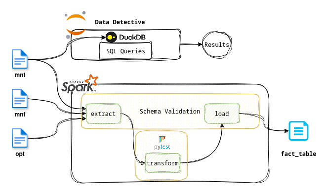
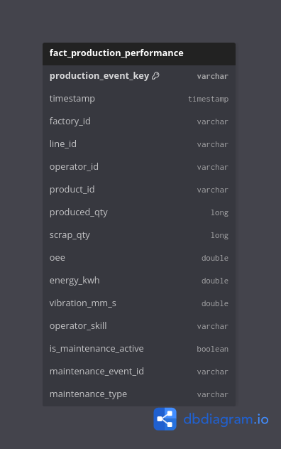

# Data Engineering Adventure J&J

> **An automated ETL pipeline for manufacturing analytics, featuring schema enforcement, interval-based joins, and robust quality metrics.**

## 📑 Table of Contents

* [🚀 How to Run this Project](#how-to-run-this-project)
  * [Prerequisites](#prerequisites)
* [📊 Overview](#overview)
* [🕵️ Data Detective ](#data-detective)
* [⚙️ PySpark ETL Pipeline](#pyspark-etl-pipeline)
* [🧪 Testing](#testing)


## How to run this project

This project includes an automated script to set up the environment, install dependencies, run tests, and execute the data pipeline.

### Prerequisites

- Python 3.10+

- Java 8 or 11 (Required for PySpark)

The easiest way to run the project is using the provided run_all.sh script. This will create a virtual environment, install requirements, and run the full suite.

```bash
# 1. Clone the repository
git clone <repo-url>
cd <project-directory>

# 2. Make the script executable
chmod +x run_all.sh

# 3. Run the project
./run_all.sh
```

## Overview

To solve the given problems I made use of Jupyter Notebook for the data detective part, PySpark for the ETL part and Pytest for testing the transformation function. The architecture for the overall solution is as follows:



## Data Detective

To answer the analytics questions I made use of a Jupyter Notebook(`notebooks/exploration.ipynb`), and running duckdb as my SQL engine. I used the CSV files and registered them as views in duckdb and querying them to answer the question.

Before jumping into the queries directly I performed some basic checks on the data to get an idea of the dataset. I made sure that there were no NULL values for *event_id*, double checked the data types of each columns to confirm timestamps were cast as *timestamps* and *cost_euro* column was cast as float etc.

In the Jupyter notebook I explain my thinking and answer the questions asked.

## PySpark ETL Pipeline

Before constructing the ETL pipeline, I first modeled the final fact table to serve as the project's analytical foundation. My goal was to consolidate data from multiple source CSV files into a centralized fact table designed for analytics. The resulting schema is as follows:



The *production_event_key* is the primary key for the table. I used the sha256 hash of the (timestamp, line_id) to create the values for the column.

With the fact table designed, I focused on designing the ETL pipeline itself. Rather than a monolithic script, I prioritized a modular, testable, and idempotent architecture. By decoupling the logic into distinct Extract, Transform, and Load functions, I ensured that each component could be independently validated and re-run without side effects.

A critical component of the transformation layer is the *build_fact_table* function. This function executes an interval-based join to merge the **manufacturing_factory_dataset** with **maintenance_events**. The main challenge was reconciling the high-frequency, point-in-time manufacturing data (recorded every 15 minutes) with the duration based maintenance logs (defined by start and end timestamps).

To address the risk of downstream breakage due to source schema changes, a common pain point in data engineering, I implemented a schema enforcement layer. Using a dedicated schema configuration (`src/utils/schema.py`) and helper utilities (`src/utils/helper.py`), the *enforce_schema* function proactively mitigates schema drift. This validation occurs at two critical checkpoints: during the initial extraction and prior to the final fact table load.

The `transformer.py` module incorporates several robust data quality checks:

- Null Handling: Missing defect_type values are assigned logical defaults.

- Zero-Division Protection: The scrap_rate is calculated using safe division logic to prevent runtime errors.

- Type Casting: Timestamps and dates are explicitly cast to maintain temporal integrity.

- Data Preservation: Left joins are utilized to ensure fact records are preserved even when dimension data is absent, allowing for the identification of data gaps.

## Testing

I implemented two basic test function to test the data cleaning logic (NULL handling, zero division), and the logic for the interval based joining. In addition to this I implemented schema_enforcer to mitigate schema drift.

To ensure production grade testing of pipeline I would use libraries such as great expectation to further improve the pipeline testing. Another approach is to utilize integration testing using a small perfect version of the data to ensure end to end pipeline run is successful. Finally, a performance benchmark would also be relevant for a production grade pipeline to ensure that the pipeline scales when data volume increases.
